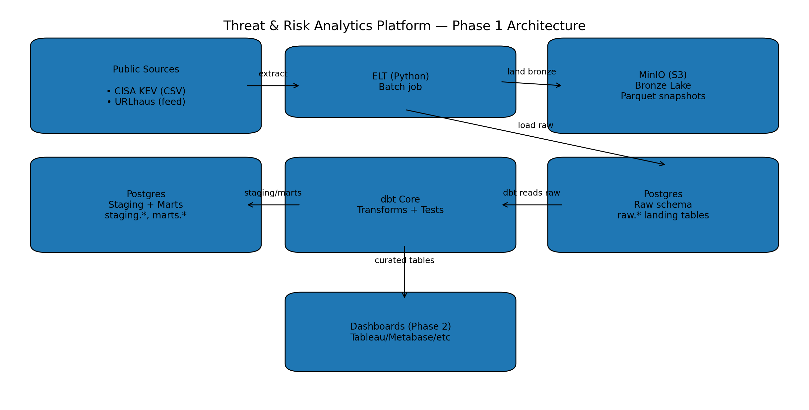
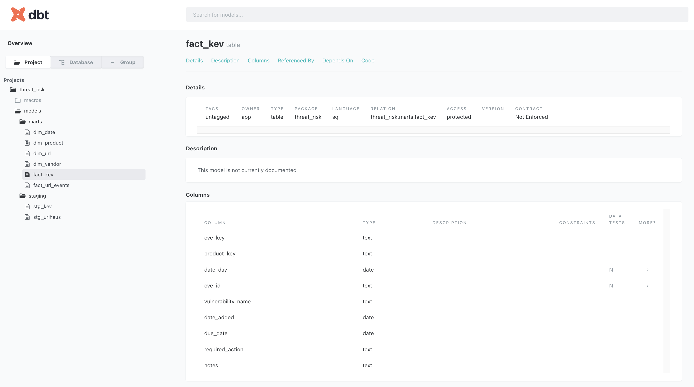
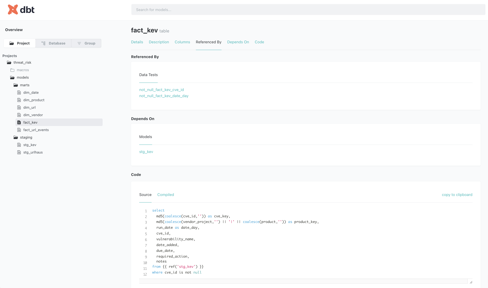

# Threat & Risk Analytics Platform (Phase 1)
**Local-first Data Engineering pipeline for cyber threat analytics**

This project demonstrates an end-to-end **batch data engineering pipeline** built locally with Docker. It ingests public cyber-security threat datasets, lands immutable raw data in an S3-compatible lake, loads raw data into a warehouse, and uses **dbt Core** to produce curated, analytics-ready fact and dimension tables with data quality tests.

> Phase 1 focuses on batch ingestion, modeling, and testing.  
> Streaming, orchestration, and dashboards are planned for later phases.

---

## 🧱 Architecture



**Flow**
1. Public threat datasets are fetched via Python batch jobs
2. Raw snapshots are written to **MinIO (Bronze layer)** as Parquet
3. Raw data is loaded into **Postgres (raw schema)**
4. **dbt Core** builds staging views and curated marts with tests
5. Curated tables are ready for BI dashboards or downstream analytics

---

## 📦 Tech Stack

- **Python** – batch ELT
- **Docker & Docker Compose** – reproducible local environment
- **MinIO** – S3-compatible data lake (bronze)
- **Postgres** – data warehouse (raw, staging, marts)
- **dbt Core** – transformations, testing, documentation
- **Make** – one-command execution

All components run **locally** with **$0 cloud cost**.

---

## 📊 Data Sources

- **CISA Known Exploited Vulnerabilities (KEV)**  
  Authoritative list of vulnerabilities exploited in the wild.

- **URLhaus (abuse.ch)**  
  Public feed of malicious URLs and malware distribution infrastructure.

---

## 🗂 Data Model (Phase 1)

### Staging (views)
- `stg_kev`
- `stg_urlhaus`

### Marts (tables)
**Dimensions**
- `dim_date`
- `dim_vendor`
- `dim_product`
- `dim_url`

**Facts**
- `fact_kev`
- `fact_url_events`

All models include **dbt tests** (`not_null`, `unique`, `accepted_values`).

---

## 🧪 Data Quality & Documentation

- dbt tests enforced on staging and marts
- dbt Docs generated with model metadata and lineage

### Example dbt Docs




---

## 🚀 Run the Pipeline (One Command)

```bash
cp .env.example .env
make run

