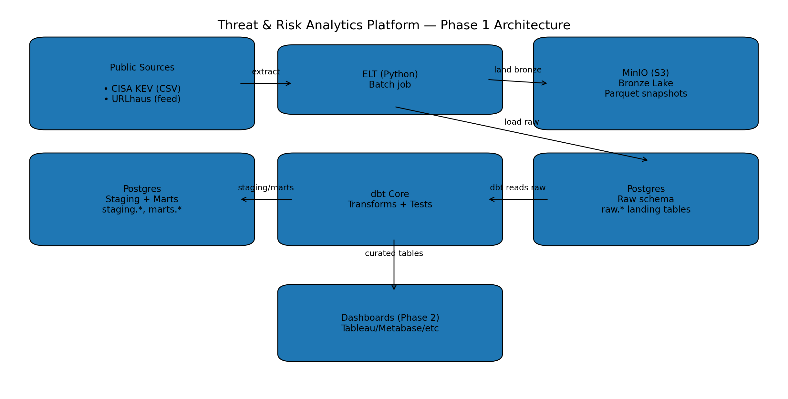
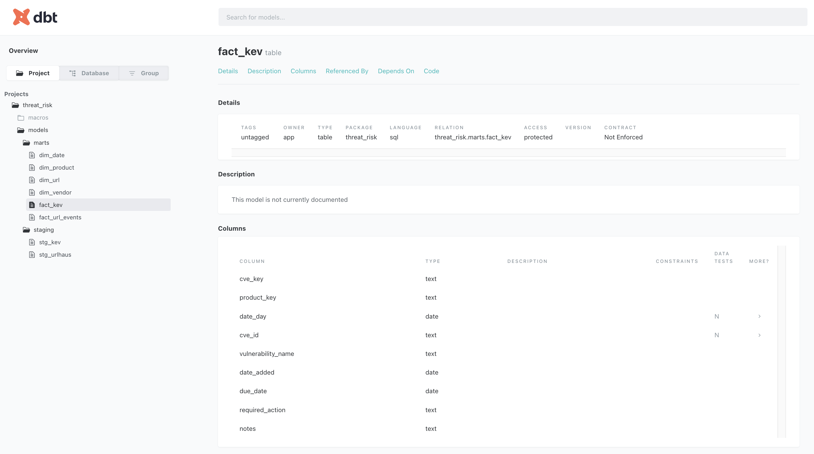
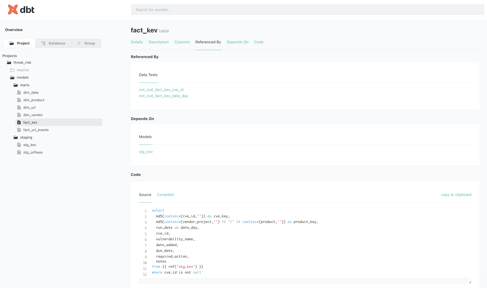

# Threat & Risk Analytics Platform  
**Hybrid Batch + Streaming Data Engineering Platform for Cyber Threat Intelligence**

This project demonstrates a **local-first, production-style data engineering architecture** for cyber threat analytics.

It evolves from a pure **batch ELT pipeline (Phase 1)** into a **hybrid batch + streaming platform (Phase 2)**, then **orchestration + observability (Phase 3)**, and finally **serving + dashboard + reliability hardening (Phase 4)** — all running locally with Docker and $0 cloud cost.

---

# 🧱 Architecture Overview

## Phase 1 — Batch ELT



### Batch Flow
1. Public threat datasets fetched via Python batch jobs  
2. Immutable snapshots written to **MinIO (Bronze layer)**  
3. Raw data loaded into **Postgres (raw schema)**  
4. **dbt Core** builds staging views and curated marts  
5. Curated tables ready for BI or analytics  

---

## Phase 2 — Streaming + Incremental

**Producer → Redpanda → Consumer → MinIO + Postgres → dbt (incremental)**

New streaming layer added:

- **Redpanda (Kafka-compatible)** for event streaming
- **Python Producer** polls URLhaus public feed and publishes events
- **Python Consumer**:
  - Writes append-only JSONL batches to **MinIO Bronze**
  - Performs **idempotent upserts** into Postgres `raw.urlhaus_events`
  - Commits offsets only after durable writes
- **dbt incremental model** builds `fct_urlhaus_threat_events` using `merge` + lookback window

The system now supports:

- At-least-once ingestion  
- Idempotent sinks  
- Late-arriving data handling  
- Incremental transformations  

All locally. No cloud services.

---

# 📦 Tech Stack

- **Python** – batch + streaming ingestion  
- **Redpanda** – Kafka-compatible event streaming  
- **Docker & Docker Compose** – reproducible local environment  
- **MinIO** – S3-compatible data lake (bronze)  
- **Postgres** – warehouse (raw, staging, marts)  
- **dbt Core** – transformations, testing, documentation  
- **Make** – one-command execution  
- **FastAPI** – serving layer for curated marts  
- **Streamlit** – recruiter-facing local dashboard  

---

# 📊 Data Sources

## CISA Known Exploited Vulnerabilities (KEV)
Authoritative list of vulnerabilities exploited in the wild.

## URLhaus (abuse.ch)
Public feed of malicious URLs and malware infrastructure.

- Batch snapshots (Phase 1)  
- Continuous streaming ingestion (Phase 2)  

---

# 🗂 Data Model

## Raw Layer
- `raw.urlhaus_events` (streaming, idempotent upsert)  
- `raw.*` batch tables  

## Staging (views)
- `stg_kev`  
- `stg_urlhaus`  
- `stg_urlhaus_events`  

## Marts

### Dimensions
- `dim_date`  
- `dim_vendor`  
- `dim_product`  
- `dim_url`  

### Facts
- `fact_kev` (batch)  
- `fact_url_events` (batch)  
- `fct_urlhaus_threat_events` (incremental, streaming)  

All models include **dbt tests** (`not_null`, `unique`, `accepted_values`).

---

# 🔁 Streaming Design Principles (Phase 2)

## Idempotency
- `event_id` primary key in Postgres raw table  
- dbt incremental `unique_key=event_id`  

## At-least-once ingestion
Kafka offsets committed only after:
- MinIO write succeeds  
- Postgres upsert succeeds  

## Append-only Bronze
- JSONL batches partitioned by `dt=YYYY-MM-DD/hour=HH`  
- Enables replay & reprocessing  

## Late-arriving data
dbt incremental model uses a configurable lookback window.

---

# 🧪 Data Quality & Observability

- dbt source tests on raw streaming table  
- Incremental model tests (`unique`, `not_null`)  
- Kafka metadata captured in raw table  
- MinIO bronze preserves immutable history

---

# 🛠 Phase 3 — Orchestration + Observability

Phase 3 adds **Prefect** as the local-first orchestrator.

Orchestrated flow tasks:

1. Run Phase 1 batch ELT (`elt/run.py`) for `run_date` or backfill date range  
2. Streaming health checks (topic exists, consumer lag, ingest freshness)  
3. `dbt build` + `dbt test`  
4. Observability artifacts under `artifacts/p3_runs/<timestamp>_<flow_run_id>/`

New observability checks include:

- dbt test pass/fail summary from `dbt/target/run_results.json`  
- streaming latency checks from `raw.urlhaus_events.ingested_at`  
- row-count guardrails for batch and stream datasets  

---

# 🧭 Phase 4 — Consumption + Reliability Hardening

Phase 4 adds:

- **FastAPI serving layer** (`services/api`) exposing curated threat/risk marts
- **Streamlit dashboard** (`services/dashboard`) for recruiter demos
- **Stronger data contracts** (dbt source freshness + streaming integrity tests)
- **CI quality gates** (lint + tests + dbt checks)

New key endpoints:

- `/health`
- `/v1/pipeline/summary`
- `/v1/trends/threat-events`
- `/v1/risk/kev-summary`

---

## 🚀 Run the Platform
### Phase 2 (Streaming + Batch)

**Copy env and start:**
```bash
cp .env.example .env
make up-p2
```

**Run dbt build:**
```bash
make dbt-p2
```

**Verify streaming + marts:**
```bash
make verify-p2
```

**View logs:**
```bash
make logs-p2
```

**Safe shutdown (keeps data):**
```bash
make down-p2
```

**Destructive reset (wipes volumes):**
```bash
make reset-p2
```

### Phase 3 (Orchestration + Observability)

**Start full stack (Phase 1 + 2 + 3):**
```bash
make up-p3
```

**Optional hello flow smoke test:**
```bash
make run-p3-hello
```

**Run full Prefect pipeline:**
```bash
make run-p3
```

**Run backfill:**
```bash
make run-p3-backfill BACKFILL_START=2026-02-15 BACKFILL_END=2026-02-17
```

**Verify services and artifacts:**
```bash
make verify-p3
```

**Prefect UI:**
```text
http://localhost:4200
```

**Logs and shutdown:**
```bash
make logs-p3
make down-p3
```

### Phase 4 (Consumption + Reliability Hardening)

**One command full demo stack (Phases 1-4):**
```bash
make demo-p4
```

**Key UIs:**
```text
Prefect:   http://localhost:4200
API Docs:  http://localhost:8000/docs
Dashboard: http://localhost:8501
```

**Phase 4 utilities:**
```bash
make up-p4
make run-p4
make verify-p4
make logs-p4
make down-p4
```

---

## 📘 dbt Documentation

**Generate docs:**
```bash
make docs
```

**Serve locally:**
```bash
make docs-serve
```

**Example screenshots:**





---

## 📚 Phase 4 Docs

- `docs/PHASE4_ARCHITECTURE.md`
- `docs/PHASE4_DEMO.md`
- `docs/PHASE4_TROUBLESHOOTING.md`
